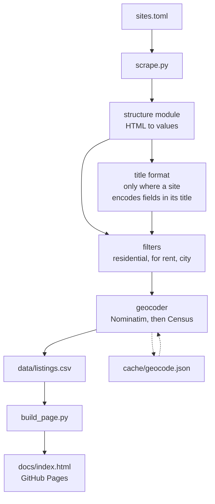

# Bend Rentals - Details

**Contents**

 - [Webpage](#webpage)
 - [Data](#data)
 - [Data Updates](#refreshing-data)
 - [Local Use](#running-locally)
 - [Property Listing Sources](#sources)
 - [Project Limitations](#project-limitations)
 - [Code Design](#code-design)

## Webpage

**[Bend Rentals](https://nbpub.github.io/bend_rentals/)** | [`index.html`](docs/index.html)

One page, hosted via GitHub Pages, holding a listings map, a set of filters
and a sortable table of everything. The filters drive the map and the table at
once, and nothing is hidden from you: a listing whose pet policy the source
never stated gets its own "not stated" tick-box rather than being quietly
folded into "no".

It is a single HTML file of plain HTML and CSS, with
[Leaflet](https://leafletjs.com/) for the map and no other dependency. There
is no framework, no build step and no bundler. The filters are ordinary
checkboxes and radio buttons, sorting is a few lines of JavaScript over the
table rows, and the markers are coloured by price band from a
[ColorBrewer](https://colorbrewer2.org/) palette. What
[`build_page.py`](build_page.py) does is read the template at
[`bendrentals/page.html`](bendrentals/page.html), substitute the day's data
into it, and write [`docs/index.html`](docs/index.html).

**The page was designed to work from a local file first**, and that is what
drove the rest of these decisions. Opening `docs/index.html` straight off
disk, with no server running, has to give you the same page GitHub Pages does.

That rules two things out. Data cannot be fetched alongside the page, because
a document opened from `file://` is not allowed to read a sibling file, so a
separate JSON would need a web server just to preview a local build. The data
is baked into the HTML instead. And the map tiles cannot come from
[OpenStreetMap's own servers](https://operations.osmfoundation.org/policies/tiles/),
whose usage policy requires a `Referer` that a `file://` page does not send.
They would serve a "blocked" image in place of a map.

Tiles come from
[Esri's World Street Map](https://www.arcgis.com/home/item.html?id=3b93337983e9436f8db950e38a8629af)
instead, which needs no API key and no `Referer`.
[CARTO's basemaps](https://carto.com/basemaps/) work too but watermark their
free tier. `build_page.py --tiles` switches between all three, and the
attribution follows the provider: Esri's cartography is not OSM's, and the
credit is not interchangeable.

The table and the company filter show each source's short `label` from
[`sites.toml`](sites.toml), not the full company name the CSV stores. Edit a
label there and re-run `build_page.py`. No re-scrape is needed, because
nothing in the data changes.

## Data

[`data/listings.csv`](data/listings.csv) is regenerated and committed daily, so
`git log -p -- data/listings.csv` is a record of what changed and when.

> **This data is presented as it was published.** It is read and saved from each
> company's own page; it is barely checked, not cleaned, and
> not validated against anything. A price, a bedroom count or a pet policy
> here can be out of date, mis-parsed, or simply wrong on the source site.
>
> Use it to explore what is available. Before acting on any of it — viewing,
> applying, budgeting — open the listing itself and contact the management
> company.

The page shows less than the CSV holds. Some columns are left off it and
others are drawn differently for cleaner web design. The CSV is the complete
record.

| Column | Notes |
|---|---|
| `company` | Property manager. The page shows the shorter `label` from `sites.toml` instead |
| `link` | Rental listing |
| `address`, `region` | Region is the Bend quadrant where one is known, else the city. Presented as reported, not checked or cleaned |
| `price`, `bedrooms`, `bathrooms`, `sqft` | The main numbers, though `bathrooms` is text so it can hold `?` |
| `property_type` | "Single family", "condo" and so on. Only published by one source |
| `available`, `available_now` | An ISO date, or a flag for "available now" |
| `cats_allowed`, `dogs_allowed` | `True` / `False` / `?`, from the site's own words |
| `maps_link`, `lat`, `lon` | Coordinates from a geocoder, or from the source. Required for a listing to appear on the map |
| `summary` | The source's headline. Longer descriptions are not saved |
| `pets_raw` | The pet sentence, verbatim and uninterpreted |
| `scraped_at`, `parse_status` | How fresh the row is, and whether it parsed cleanly |

Two conventions run through all of it:

- **`?` means the site did not say it.** An empty cell always means a bug.
  Silence is never read as a "no": a listing whose pet policy mentions only
  dogs leaves `cats_allowed` at `?`, because guessing `False` would hide
  places that do take cats.
- **A listing is never dropped for being unreadable.** A row we could only
  half-parse is written with `parse_status = partial` and a warning, never
  omitted. Quietly producing fewer rows is the failure this is built to avoid.

The long body copy of each listing is deliberately not stored. It is read
during parsing, for the bathroom count and the pet policy, and then discarded.
`summary` is the only prose kept.

## Refreshing Data

The published page keeps itself current with GitHub Actions.

[`.github/workflows/update.yml`](.github/workflows/update.yml) runs once a day
on GitHub's servers at 13:00 UTC, early morning locally: [`update.py`](update.py) calls
[`scrape.py`](scrape.py) and then [`build_page.py`](build_page.py). It takes a
little over two minutes, nearly all of it spent waiting politely between
requests, as described under
[how long a run takes](#how-long-a-run-takes). It then commits three files
back to the repository:

- [`data/listings.csv`](data/listings.csv): the day's listings
- [`cache/geocode.json`](cache/geocode.json): any addresses newly resolved
- [`docs/index.html`](docs/index.html): the rebuilt page

**Notes**

- **A source failing does not lose the day.** A source that cannot be read,
  for any reason, exits with a warning rather than an error, so the run
  carries on. The companies that answered are committed, the ones that did not
  keep the listings they already had, and the page is rebuilt either way. Only
  a misconfiguration stops the job. `scraped_at` is how you tell which rows
  are which.
- **A failed source says why on the run summary.** The reason is written as a
  GitHub annotation rather than only into the log, because reading a run log
  needs an authenticated request even on a public repository. The summary is
  public, so anyone can see whether a host refused the connection or served
  something that was not its listings page.

[`.github/workflows/tests.yml`](.github/workflows/tests.yml) runs the test suite on every push, across three versions of Python.
Those tests read saved copies of each source's pages and never touch the
network, so they cannot fail because a website was slow.

### Reading what changed

Nothing publishes a changelog of listings, but the history is available in two
forms.

**In the repository**, every daily commit to `data/listings.csv` is a diff of
what moved. `git log -p -- data/listings.csv` reads them all. Bear in mind
that `scraped_at` is rewritten on every row every run, so most of what a diff
shows is that the file was re-read rather than that anything changed.

**Locally**, [`changes.py`](changes.py) says it in words instead:

```bash
python changes.py                    # the two most recent local runs
python changes.py old.csv new.csv    # two named files
```

It reports listings that appeared, listings that are gone, and fields that
moved, with their before and after. It compares the dated copies that
`scrape.py` leaves in `data/snapshots/`, and those are local only: they are
not committed, so a fresh clone has none and the `git log` above is the
equivalent.

Three fields are deliberately ignored: `scraped_at`, `lat` and `lon`.

`scraped_at` changes on every row of every run by definition. Coordinates are
subtler, and the reason to ignore them is that they are not published data.
No source except the two Rentvine ones states them; everywhere else they are
derived from the address after the fact. So when they move, it is usually news
about this project rather than about the rental: a geocoder has resolved an
address it could not resolve before, or an address deferred past a run's
[lookup ceiling](#geocoding) has had its turn. Reporting those as changed
listings would bury the real changes underneath them.

## Running Locally

Requires Python 3.11 or newer, and two packages:
[requests](https://requests.readthedocs.io/) to fetch pages and
[Beautiful Soup](https://www.crummy.com/software/BeautifulSoup/bs4/doc/) to
read them. Both are in [`requirements.txt`](requirements.txt). Running the
tests also needs [pytest](https://docs.pytest.org/), which is not.

### Setup

```bash
git clone https://github.com/NBPub/bend_rentals.git
cd bend_rentals

python -m venv .venv
./.venv/Scripts/python.exe -m pip install -r requirements.txt   # Windows
# source .venv/bin/activate && pip install -r requirements.txt  # macOS / Linux
```

### Usage

```bash
python update.py              # scrape everything, rebuild the page
python update.py --open       # ...and open it
python scrape.py trailhead    # one source
python build_page.py --open   # rebuild the page from the CSV alone
python changes.py             # what moved between the last two local runs
python -m pytest              # the test suite, offline
```

### How long a run takes

A little over two minutes, almost all of it spent waiting between requests.
That is deliberate and is not something to tune down.

**The cost is per source, not per listing.** Eleven of the sixteen are
AppFolio portals that put every field on one index page, so each costs a
single request. But `appfolio.com` publishes `Crawl-delay: 10`, so that one
request costs ten seconds whether the source has four listings or forty. Those
eleven are 110 of the roughly 140 seconds. Only the three sources needing a
page per listing scale with how many listings there are, at 1.5s each.

So, roughly:

- +10s for each new AppFolio source
- +1.5s for each listing on a source that needs a page per listing
- +0s for any number of extra listings on the AppFolio sources

### Geocoding

Most sources publish an address and no coordinates, so coordinates are looked
up: [Nominatim](https://nominatim.openstreetmap.org/) first, then Nominatim
again without the unit number, then the
[US Census geocoder](https://geocoding.geo.census.gov/geocoder/), which knows
many addresses OpenStreetMap has not mapped. The two Rentvine sources publish
real coordinates and skip all of this.

Geocoding is charged separately from the run time above, at 10s per address,
and only for addresses [`cache/geocode.json`](cache/geocode.json) cannot
already answer. That is zero on a normal day. It is why an occasional run
takes four or five minutes rather than two.

Two rules keep it that way, both from OSM's usage policy:

- **Never ask twice.** The cache is committed, so a fresh clone geocodes
  nothing at all. A resolved address is kept for good, because coordinates do
  not move. A failure is kept for thirty days only, because it meant "not
  mapped yet", which is a statement about today rather than about the address.
- **Identify the application.** The geocoders are the one place the User-Agent
  is not deliberately unremarkable. It names this repository, and carries no
  email address.

A run looks up at most 50 new addresses by default, so an unattended run
cannot turn into an hours-long crawl the first time a wide filter finds
hundreds of them. Nothing is lost by reaching that ceiling: whatever resolved
is cached, and the remainder are looked up on the following run.
`--backfill` drops the delay to 2s for a bounded catch-up, and
`--geocode-limit` raises the ceiling.

### Flags and exit codes

Each flag belongs to the command in the middle column. `update.py` passes the
ones it recognises down to the step that understands them, and gives the rest
to nobody.

| Flag | On | Effect |
|---|---|---|
| `--backfill` | `scrape.py` | Geocode at 2s rather than 10s, for a bounded catch-up |
| `--no-geocode` | `scrape.py` | Skip geocoding; new listings get no coordinates |
| `--geocode-limit N` | `scrape.py` | New addresses to look up this run (default 50) |
| `--no-snapshot` | `scrape.py` | Skip the dated local copy; what CI uses |
| `--tiles NAME` | `build_page.py` | `esri`, `carto-light`, `carto-voyager`, `osm` |
| `--out FILE` | `build_page.py` | Write somewhere other than `docs/index.html` |
| `--csv FILE` | `build_page.py` | Build from a different CSV |
| `--skip-scrape`, `--skip-page` | `update.py` | Run only one half |

Every command exits 0 when it worked, 1 when something partial went wrong such
as a source being down, and 2 when it was misconfigured. That is the
convention Python describes under
[`sys.exit`](https://docs.python.org/3/library/sys.html#sys.exit). `update.py`
acts on it: it carries on past a 1 and stops on a 2, because one site being
down is no reason to skip the page for the other fifteen. The scheduled
workflow follows the same rule, and commits what it did get.

## Sources

Sixteen companies, five parsers. [`sites.toml`](sites.toml) is the registry,
and each entry carries a `notes` field recording where that source's data
actually lives and how it was found. The parsers are in
[`bendrentals/structures/`](bendrentals/structures), one per platform. The
company list, with links to each company's own page, is on the
[README](README.md#companies).

Most of these companies' own websites render their listings with JavaScript
and serve HTML containing none of them. What is scraped instead is the
platform underneath: an [AppFolio](https://www.appfolio.com/) tenant
subdomain, a [Buildium](https://www.buildium.com/) resident portal, or the
JSON endpoint a [Rentvine](https://www.rentvine.com/) page's own widget reads.

### AppFolio: eleven of the sixteen

Every field is on the index card, so one request covers the whole source.
These portals publish `Crawl-delay: 10`, which is most of what
[a run costs](#how-long-a-run-takes).

| Company | Read from | Cities | Note |
|---|---|---|---|
| Velocity | `velocitypm` | Bend | Their rentals page is an iframe wrapped around the portal |
| High Desert | `highdesertpm` | Bend | Their own front end is [Next.js](https://nextjs.org/) and renders nothing server-side |
| Bend PM | `bend` | Bend, Redmond | |
| Utopia | `utopiamanagement` | Bend | A national company. The city parameter is mandatory here, not a nicety |
| Elevation | `elevationpropmgmt` | Bend | |
| Mountain View | `mountainviewpm` | Bend, Redmond | |
| Superior | `asuperior` | Bend, Prineville | |
| High Country | `highcountrypropmgmt` | Bend | |
| Plus | `pluspmllc` | Bend, Prineville, Redmond | The portal carries pet policies their own page leaves out |
| Mt. Bachelor | `mtbachpm` | Bend, Redmond, Sisters, Prineville | States a pet policy on every card, and refuses cats on all of them. Their position, not a parse failure |
| Lifestyles | `lifestylesrealty` | Bend, Redmond, Sunriver | |

<details>
<summary>How the portals were found</summary>

None of these subdomains is advertised. Each was reached from a link the
company's own site has to publish anyway:

- Elevation: a [Squarespace](https://www.squarespace.com/) shell that renders
  no listings. Found through its tenant login link.
- Mountain View, Superior and High Country: [Duda](https://www.duda.co/) sites.
  Each one resolved from its "Pay Rent" link.
- Lifestyles: also Duda, but reading a synced AppFolio collection, so the
  portal name appears nowhere in its HTML. It came from the Tenant Portal link.
- Plus: a WordPress feed of the portal.
- Velocity: the rentals page is an iframe whose `src` is the portal.

The full address in each case is `https://<subdomain>.appfolio.com/listings`
with `filters[cities][]=Bend` appended. See the `index_url` of each entry in
[`sites.toml`](sites.toml).

</details>

### The other five

| Company | Platform | Read from | Note |
|---|---|---|---|
| Trailhead | [Squarespace](https://www.squarespace.com/) | same domain | The only source whose listing *title* carries the data |
| Hummingbird | [Buildium](https://www.buildium.com/) | same domain | Index cards do not link to their own detail pages |
| Preferred Residential | [WordPress](https://wordpress.org/) | same domain | Publishes no street address. The only source stating a property type |
| Ridgeline | [Rentvine](https://www.rentvine.com/) | `ridgelinepropertymgmt` | Explicit cat and dog booleans, and real coordinates |
| PMI | [Rentvine](https://www.rentvine.com/) | `pmicentraloregon` | The same endpoint shape as Ridgeline, so it needed no new code |

<details>
<summary>What each of them needs that the others do not</summary>

- Trailhead encodes everything in the title —
  `$3,550 / 3br - 2472ft2 - Description (SW Bend)` — so it needs a page per
  listing and a title parser, the only one in
  [`bendrentals/formats/`](bendrentals/formats). Its second portfolio is
  vacation rentals and is deliberately left alone.
- Hummingbird's index cards carry no link to their own detail pages, so the
  parser collects the detail URLs and reads those. Those pages also carry a
  pet policy the index omits.
- Preferred Residential publishes no street address: the only one on a
  property page is the agency's own office, out of the footer map. The address
  and coordinates come from resolving its "View This Rental on a Map" short
  link instead, which reads the redirect target and never fetches a page.
- Ridgeline and PMI are Rentvine. The vacancies page is a JavaScript
  widget; what is read is the public JSON endpoint that widget itself calls.
  It is the richest data here, and needs no geocoding at all. PMI advertises
  commercial and short-term rentals separately, and this endpoint carries
  neither. It covers Bend, Prineville, Madras and Hubbard with no source-side
  city filter, so that rule is applied locally.

</details>

### Politeness

Set in [`fetch.py`](bendrentals/fetch.py). Requests are spaced per domain: 10s
for `appfolio.com` and for the geocoders, 1.5s everywhere else, which is what
makes [a run](#how-long-a-run-takes) take the time it does. The User-Agent is
deliberately unremarkable except at the geocoders, whose policies require an
application to identify itself; there it names this repository and carries no
email address. No source disallows what is fetched.

### Filtering

Three rules, all in [`filters.py`](bendrentals/filters.py), all asymmetric on
purpose: a listing is dropped only when it can be *proven* not to qualify.

- **Residential rather than commercial.** Either the source states a
  commercial property type, or its own headline names a commercial space.
  - The headline check matches two-word nouns such as "office suite" or
    "retail space", never bare words. In one real run, five headlines
    mentioned "office", "suite" or "storage" and only one was commercial. The
    rest were houses with a bonus-room office, a loft/office, and storage.
    Matching `office` alone would have discarded four homes to catch one
    office.
- **Something actually for rent.** A stated rent of exactly `$0` means the
  source is not offering a unit. AppFolio publishes tenant application forms
  in the same feed as its listings, priced at zero. An *unreadable* price is
  not zero and is kept, so a site's redesign can never empty the file.
- **The city**, set to `Bend` under `[scrape]` in [`sites.toml`](sites.toml).
  Clear it to keep every city a source lists, and remove the
  `filters[cities][]` parameter from the AppFolio URLs to match. Note that one
  source is a national company returning several hundred listings across many
  states without it.

Nothing is filtered on bedrooms, price or pet policy. Those are choices for
whoever is looking, and they belong in the page's tick-boxes.

## Project Limitations

- **Bathrooms from Trailhead are a best guess.**
  - It is the one source with no bathroom field, so the count is read from the
    listing's prose and, failing that, from the digits in a photo filename.
    `3-br-25-bath-house.jpg` is read as 2.5.
  - It is the least trustworthy value in the file. Every other source states
    the number outright.
- **Preferred Residential publishes no street address.**
  - The only one on a property page belongs to the agency's own office, so
    using it would stack every one of their listings on a single point.
  - The address and coordinates come from resolving the "View This Rental on a
    Map" link instead, which means a listing without that link has no address
    at all.
- **Some addresses cannot be placed.**
  - Coordinates come from [Nominatim](https://nominatim.openstreetmap.org/),
    then from the
    [US Census geocoder](https://geocoding.geo.census.gov/geocoder/) for the
    addresses OpenStreetMap has not mapped, which are usually new streets.
  - What neither resolves gets no marker, and is listed under the map rather
    than guessed at.
  - Not permanently, though. A failure means "not mapped yet", which is a
    statement about today, so it is retried after thirty days. A listing can
    therefore move from the list below the map onto the map itself weeks
    later, without its own details having changed at all.
  - Some of them will never resolve on their own. Several of the addresses
    currently unplaced are missing a street suffix at the source, so no amount
    of waiting helps; the company would have to correct its own listing.
- **Listings are matched between runs by URL.**
  - A company that reissues one under a new URL looks like a removal and an
    addition rather than a change.
- **`region` mixes two things.**
  - Where a source labels a listing itself, that label is used as published.
    Otherwise the Bend quadrant is read off the address.
  - A source's own label can name a neighbourhood or an outlying community
    rather than a quadrant, so the filter list holds a few values that are not
    NE/NW/SE/SW. Correct, and still a little surprising.
  - A listing known only to be "in Bend" shows whenever any Bend quadrant is
    ticked, because it could be in any of them.
- **There is no notion of a listing being taken down mid-day.**
  - The page is as fresh as its last run, and says so at the top.

## Code Design



A source is described by two independent things, which is why a seventeenth one
usually needs no code:

- [`structure`](bendrentals/structures): how to get values out of the page.
  Named for the platform, not the company, because eleven of the sixteen run
  on AppFolio.
- [`title_format`](bendrentals/formats): how to decode a title string into
  fields. Only Trailhead needs one; the rest expose each value in its own
  element.

### The rest of the package

| File | Responsibility |
|---|---|
| [`models.py`](bendrentals/models.py) | `Listing`. The single source of truth for the CSV columns |
| [`registry.py`](bendrentals/registry.py) | Reads `sites.toml` into site objects, and holds the paths |
| [`scraper.py`](bendrentals/scraper.py) | Wires a structure and a format together into `Listing` rows |
| [`fetch.py`](bendrentals/fetch.py) | The only thing that makes a request. Per-domain delays and User-Agents |
| [`extract.py`](bendrentals/extract.py) | Bathrooms and pet policies out of free text |
| [`dates.py`](bendrentals/dates.py) | The four "available" formats sources use, into one ISO date |
| [`place.py`](bendrentals/place.py) | City and Bend quadrant from an address |
| [`filters.py`](bendrentals/filters.py) | The three rules above, and what may be dropped |
| [`geocode.py`](bendrentals/geocode.py) | Nominatim then Census, and the cache |
| [`csv_out.py`](bendrentals/csv_out.py) | Reading, merging and writing the CSV, including snapshots |
| [`diff.py`](bendrentals/diff.py) | Compares two snapshots for `changes.py` |
| [`mapdata.py`](bendrentals/mapdata.py) | Rows into map records. Price banding, and all escaping |
| [`pagehtml.py`](bendrentals/pagehtml.py) | Fills the template with those records |
| [`page.html`](bendrentals/page.html) | The template itself. Edit the page here |

Two helper scripts live in [`tools/`](tools) and are not part of a run.
`strip_fixtures.py` removes the framework bulk from a saved test fixture, and
`parse_snapshot.py` captures everything all five parsers can read out of the
fixtures, so the two together prove a strip changed nothing. Both are
described under
[Contributing](CONTRIBUTING.md#refreshing-a-fixture).
[`conftest.py`](conftest.py) puts the repository root on the path so the tests
can import the entry-point scripts.

Two files earn their place in git rather than being build output:

- [`data/listings.csv`](data/listings.csv), because its commit history is the
  record of what changed.
- [`cache/geocode.json`](cache/geocode.json), because rebuilding it means
  re-asking Nominatim about every address. See [Geocoding](#geocoding).

[`docs/index.html`](docs/index.html) is committed too, but as output rather
than source: the scheduled run rewrites it every day. Edit
[`bendrentals/page.html`](bendrentals/page.html) instead. A change made to the
built page is gone by morning.
