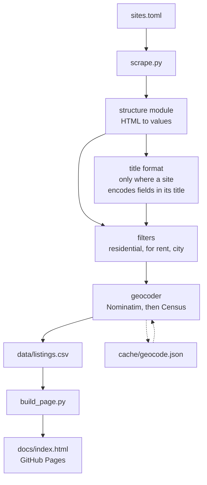

# Bend Rentals - Details

**Contents**

 - [Webpage](#webpage)
 - [Data](#data)
 - [Data Updates](#refreshing-data)
 - [Local Use](#running-locally)
 - [Code Design](#code-design) 
 - [Property Listing Sources](#sources) 
 - [Project Limitations](#project-limitations)

## Webpage

**[Bend Rentals](https://nbpub.github.io/bend_rentals/)**

One page — a map, a set of filters, and a sortable table of everything. The
filters drive all three at once, and nothing is hidden from you: a listing
whose pet policy the source never stated gets its own "not stated" tick-box
rather than being quietly folded into "no".

**Built with.** [Leaflet](https://leafletjs.com/) for the map, and nothing
else. There is no framework, no build step and no bundler: the page is a
single HTML file written by
[`build_page.py`](build_page.py) from
[`bendrentals/page.html`](bendrentals/page.html).

**Tiles** come from
[Esri's World Street Map](https://www.arcgis.com/home/item.html?id=3b93337983e9436f8db950e38a8629af),
chosen because it needs no API key and no `Referer`.
[OpenStreetMap's own tiles](https://operations.osmfoundation.org/policies/tiles/)
require one, which a page opened from a local file cannot send, so they would
show a "blocked" image instead of a map.
[CARTO's basemaps](https://carto.com/basemaps/) work too but watermark their
free tier. `build_page.py --tiles` switches between all three, and the
attribution follows the provider — Esri's cartography is not OSM's, and the
credit is not interchangeable.

**Data** is baked into the page rather than fetched. A page opened from
`file://` cannot read a sibling file, so a separate JSON would need a web
server just to preview a local build.

The table and the company filter show each source's short `label` from
[`sites.toml`](sites.toml), not the full company name the CSV stores. Edit a
label there and re-run `build_page.py`: no re-scrape, because nothing in the
data changes.

## Data

[`data/listings.csv`](data/listings.csv) is regenerated and committed daily, so
`git log -p -- data/listings.csv` is a record of what changed and when.

> **This data is presented as it was published.** It is read and saved from each
> company's own page; it is barely checked, not cleaned, and
> not validated against anything. A price, a bedroom count or a pet policy
> here can be out of date, mis-parsed, or simply wrong on the source site.
>
> Use it to explore what is available. Before acting on any of it — viewing,
> applying, budgeting — open the listing itself and contact the management
> company.

**The page shows less than the file.** Some columns are left off it and others
are drawn differently, for the sake of a table you can read: `property_type`
is omitted because only one source publishes it, `maps_link` rides along
inside the address rather than taking a column, and the pet and availability
columns become a tick or a cross. The CSV is the complete record.

| Column | Notes |
|---|---|
| `company` | Property manager. `label`/`company` from `sites.toml` instead |
| `link` | Rental listing |
| `address`, `region` | Region is the Bend quadrant where one is known, else the city. Presented as reported, data is not checked and cleaned |
| `price`, `bedrooms`, `bathrooms`, `sqft` | Main numberical data of each listing, though `bathrooms` is text, so it can hold `?` |
| `property_type` | "Single family", "condo", etc . . . Only published by one source. |
| `available`, `available_now` | An ISO date, or a flag for "available now" |
| `cats_allowed`, `dogs_allowed` | `True` / `False` / `?`, from the site's own words |
| `maps_link`, `lat`, `lon` | Coordinates from a geocoder, or from the source. Coordinates required for mapping as shown on webpage. |
| `summary` | The source's headline. Longer descriptions not saved. |
| `pets_raw` | The pet sentence, verbatim and uninterpreted |
| `scraped_at`, `parse_status` | Staleness and healthiness indicator of scraped data |


Two conventions run through all of it:

- **`?` means the site did not say it.** An empty cell always means a bug.
  Silence is never read as a "no": a listing whose pet policy mentions only
  dogs leaves `cats_allowed` at `?`, because guessing `False` would hide
  places that do take cats.
- **A listing is never dropped for being unreadable.** A row we could only
  half-parse is written with `parse_status = partial` and a warning, never
  omitted. Quietly producing fewer rows is the failure this is built to avoid.

The long body copy of each listing is deliberately not stored. It is read
during parsing, for the bathroom count and the pet policy, and then discarded:
`summary` is the only prose kept.

## Refreshing Data

The published page keeps itself current. Nobody runs anything by hand.

[`.github/workflows/update.yml`](.github/workflows/update.yml) runs once a day
on GitHub's servers — 13:00 UTC, which is early morning in Bend — and does
what a local run does: [`update.py`](update.py) calls
[`scrape.py`](scrape.py) and then [`build_page.py`](build_page.py). It then
commits three files back to the repository:

- [`data/listings.csv`](data/listings.csv) — the day's listings
- [`cache/geocode.json`](cache/geocode.json) — any addresses newly resolved
- [`docs/index.html`](docs/index.html) — the rebuilt page, which is what
  GitHub Pages serves

**A source failing does not lose the day.** The scrape returns 1 when any one
of the thirteen has trouble, and the workflow treats that as a warning rather
than a failure: the companies that answered are committed, and the ones that
did not keep the listings they already had. Only a misconfiguration stops the
job. Their `scraped_at` is how you tell which is which.

[`.github/workflows/tests.yml`](.github/workflows/tests.yml) is the other
half: it runs the test suite on every push, across three versions of Python.
Those tests read saved copies of each source's pages and never touch the
network, so they cannot fail because a website was slow.

### Reading what changed

Nothing publishes a changelog of listings, but the history is there in two
forms.

**In the repository**, every daily commit to `data/listings.csv` is a diff of
what moved. `git log -p -- data/listings.csv` reads them all. Bear in mind
that `scraped_at` is rewritten on every row every run, so most of what a diff
shows is that the file was re-read rather than that anything changed.

**Locally**, [`changes.py`](changes.py) says it in words instead:

```bash
python changes.py                    # the two most recent local runs
python changes.py old.csv new.csv    # two named files
```

It reports listings that appeared, listings that went, and fields that moved
with their before and after — deliberately ignoring `scraped_at`, `lat` and
`lon`, which change without a listing changing. It compares the dated copies
that `scrape.py` leaves in `data/snapshots/`, and those are local only: they
are not committed, so a fresh clone has none and the `git log` above is the
equivalent.

## Running Locally

Requires Python 3.11 or newer, and two packages:
[requests](https://requests.readthedocs.io/) to fetch pages and
[Beautiful Soup](https://www.crummy.com/software/BeautifulSoup/bs4/doc/) to
read them. Both are in [`requirements.txt`](requirements.txt). Running the
tests also needs [pytest](https://docs.pytest.org/), which is not.

### Setup

```bash
git clone https://github.com/NBPub/bend_rentals.git
cd bend_rentals

python -m venv .venv
./.venv/Scripts/python.exe -m pip install -r requirements.txt   # Windows
# source .venv/bin/activate && pip install -r requirements.txt  # macOS / Linux
```

### Usage

```bash
python update.py              # scrape everything, rebuild the page
python update.py --open       # ...and open it
python scrape.py trailhead    # one source
python build_page.py --open   # rebuild the page from the CSV alone
python changes.py             # what moved between the last two local runs
python -m pytest              # the test suite, offline
```

A full run takes about two minutes, almost all of it spent waiting between
requests. That is deliberate and is not something to tune down.

**The cost is per source, not per listing.** Nine of the thirteen are AppFolio
portals that put every field on one index page, so each costs a single request
— but `appfolio.com` publishes `Crawl-delay: 10`, so that request costs ten
seconds whether the source has four listings or forty. Those nine are 90 of
the ~128 seconds. Only the three sources needing a page per listing scale with
how many there are, at 1.5s each.

So, roughly:

- **+10s** for each new AppFolio source
- **+1.5s** for each listing on a source that needs a page per listing
- **+0s** for any number of extra listings on the AppFolio sources

Geocoding is charged separately and only for addresses never seen before, at
10s each — the cache is permanent, so this is zero on a normal day and is why
an occasional run takes four or five minutes instead of two.

Flags adjust what a command does — how fast it geocodes, where it writes, or
which half of the pipeline it runs. Each belongs to the command in the middle
column; `update.py` passes the ones it recognises down to the step that
understands them, and gives the rest to nobody.

| Flag | On | Effect |
|---|---|---|
| `--backfill` | `scrape.py` | Geocode at 2s rather than 10s, for a bounded catch-up |
| `--no-geocode` | `scrape.py` | Skip geocoding; new listings get no coordinates |
| `--geocode-limit N` | `scrape.py` | New addresses to look up this run (default 50) |
| `--no-snapshot` | `scrape.py` | Skip the dated local copy; what CI uses |
| `--tiles NAME` | `build_page.py` | `esri`, `carto-light`, `carto-voyager`, `osm` |
| `--out FILE` | `build_page.py` | Write somewhere other than `docs/index.html` |
| `--csv FILE` | `build_page.py` | Build from a different CSV |
| `--skip-scrape`, `--skip-page` | `update.py` | Run only one half |

Every command exits 0 when it worked, 1 when something partial went wrong (a
source was down), and 2 when it was misconfigured — the convention Python
describes under
[`sys.exit`](https://docs.python.org/3/library/sys.html#sys.exit). `update.py`
acts on it: it carries on past a 1 and stops on a 2, because one site being
down is no reason to skip the page for the other twelve. The scheduled
workflow follows the same rule, and commits what it did get.

## Code Design



A source is described by two independent things, which is why a fourteenth one
usually needs no code:

- **[`structure`](bendrentals/structures)**: how to get values out of the
  page. Named for the platform, not the company, because nine of the thirteen
  run on AppFolio.
- **[`title_format`](bendrentals/formats)**: how to decode a title string into
  fields. Only Trailhead needs one; the rest expose each value in its own
  element.

Two files earn their place in git rather than being build output:

- [`data/listings.csv`](data/listings.csv), because its commit history is the
  record of what changed.
- [`cache/geocode.json`](cache/geocode.json), because rebuilding it means
  re-asking Nominatim about every address. Coordinates for a street address do
  not change, so the cache is permanent and a fresh clone geocodes nothing.

[`docs/index.html`](docs/index.html) is committed too, but as output rather
than source: the scheduled run rewrites it every day. Edit
[`bendrentals/page.html`](bendrentals/page.html) instead — a change made to
the built page is gone by morning.

## Sources

Thirteen companies, five parsers. [`sites.toml`](sites.toml) is the registry,
and each entry carries a note about where its data actually lives. The parsers
are in [`bendrentals/structures/`](bendrentals/structures), one per platform.

Most of these companies' own websites render their listings with JavaScript and
serve HTML containing none of them. What is scraped instead is the
platform underneath: an AppFolio tenant subdomain, a Buildium resident portal,
or the JSON endpoint a Rentvine page's own widget reads.

**Politeness.** Set in [`fetch.py`](bendrentals/fetch.py). Requests are
spaced per domain: 1.5s by default, and 10s for
`appfolio.com`, which publishes `Crawl-delay: 10` and accounts for most of a
run's duration. The User-Agent is deliberately unremarkable everywhere except
the geocoders, whose policies require an application to identify itself; it
carries a link to this repository and no email address. No source disallows
what is fetched.

**Filtering.** Three rules, all in
[`filters.py`](bendrentals/filters.py), all asymmetric on purpose: a listing
is dropped only when it can be *proven* not to qualify.

- **Residential rather than commercial.** Either the source states a
  commercial property type, or its own headline names a commercial space.
  - The headline check matches two-word nouns ("office suite", "retail
    space"), never bare words. In one real run, five headlines mentioned
    "office", "suite" or "storage" and only one was commercial: the rest were
    houses with a bonus-room office, a loft/office, and storage. Matching
    `office` alone would have discarded four homes to catch one office.
- **Something actually for rent.** A stated rent of exactly `$0` means the
  source is not offering a unit. AppFolio publishes tenant application forms
  in the same feed as its listings, priced at zero. An *unreadable* price is
  not zero and is kept, so a site's redesign can never empty the file.
- **The city**, set to `Bend` under `[scrape]` in [`sites.toml`](sites.toml). Clear it to
  keep every city a source lists, and remove the `filters[cities][]` parameter
  from the AppFolio URLs to match. Note that one source is a national company
  returning several hundred listings across many states without it.

Nothing is filtered on bedrooms, price or pet policy. Those are choices for
whoever is looking, and they belong in the page's tick-boxes.

## Project Limitations

- **Bathrooms from Trailhead are a best guess.** It is the one source with no
  bathroom field, so the count is read from the listing's prose and, failing
  that, from the digits in a photo filename — `3-br-25-bath-house.jpg` is read
  as 2.5. It is the least trustworthy value in the file. Every other source
  states the number outright.
- **Preferred Residential publishes no street address.** The only one on a
  property page belongs to the agency's own office, so using it would stack
  every listing on one point. The address and coordinates come from resolving
  the "View This Rental on a Map" link instead, which means a listing without
  that link has no address at all.
- **Some addresses cannot be placed.** Coordinates come from
  [Nominatim](https://nominatim.openstreetmap.org/), then from the
  [US Census geocoder](https://geocoding.geo.census.gov/geocoder/) for the
  addresses OpenStreetMap has not mapped — usually new streets. What neither
  resolves gets no marker, and is listed under the map rather than guessed at.
- **Listings are matched between runs by URL.** A company that reissues one
  under a new URL looks like a removal and an addition rather than a change.
- **`region` mixes two things.** Where a source labels a listing itself, that
  label is used as published; otherwise the Bend quadrant is read off the
  address. A source's own label can name a neighbourhood or an outlying
  community rather than a quadrant, so the filter list holds a few values that
  are not NE/NW/SE/SW — correct, and still a little surprising. A listing
  known only to be "in Bend" shows whenever any Bend quadrant is ticked,
  because it could be in any of them.
- **There is no notion of a listing being taken down mid-day.** The page is as
  fresh as its last run, and says so at the top.